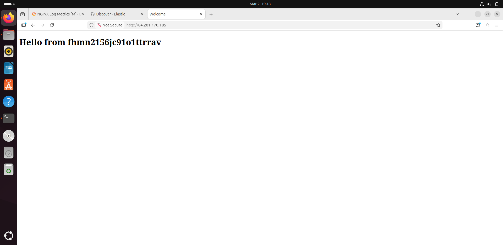
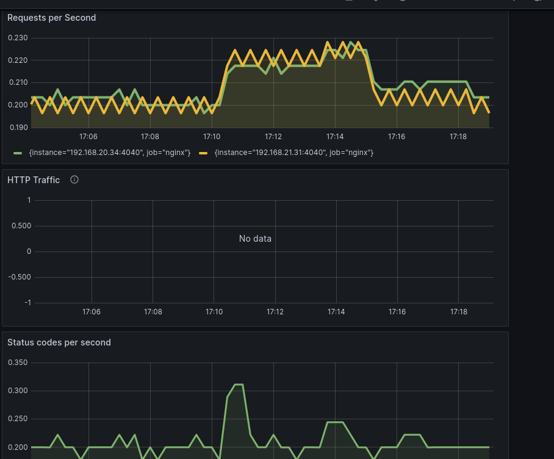
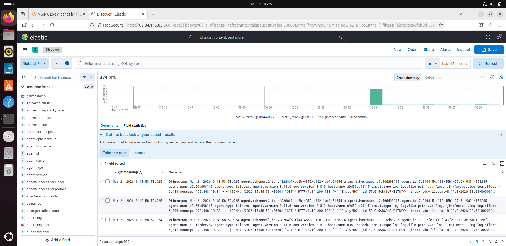
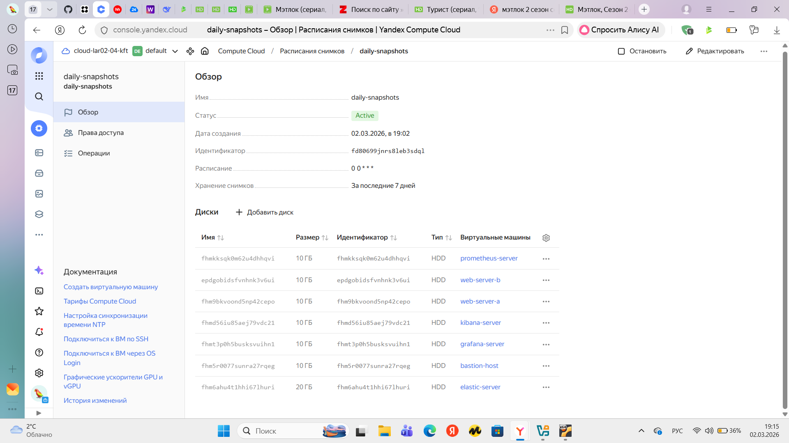

# Дипломный проект: Отказоустойчивая инфраструктура для сайта в Yandex Cloud

## Описание проекта
Разработка отказоустойчивой инфраструктуры для сайта с мониторингом, сбором логов и резервным копированием в Yandex Cloud с использованием Terraform и Ansible.

---

## Задание

### Инфраструктура
- Две ВМ с nginx в разных зонах доступности (ru-central1-a, ru-central1-b)
- Target Group, Backend Group, HTTP router
- Application Load Balancer для распределения трафика
- Bastion host для безопасного доступа

### Мониторинг
- ВМ с Prometheus для сбора метрик
- Node Exporter и Nginx Log Exporter на веб-серверах
- ВМ с Grafana и подключение к Prometheus
- Дашборды с метриками

### Логи
- ВМ с Elasticsearch
- ВМ с Kibana
- Filebeat для сбора логов nginx

### Сеть
- VPC с публичными и приватными подсетями
- Security Groups с правилами доступа
- Bastion host для SSH доступа

### Резервное копирование
- Ежедневные снапшоты дисков всех ВМ
- Хранение снапшотов — 7 дней

---

## Архитектура решения
```
┌─────────────────────────────────────────────────────────────┐
│                      Yandex Cloud VPC                        │
│                                                              │
│  ┌─────────────────────────┐  ┌─────────────────────────┐   │
│  │   Публичная подсеть     │  │   Приватная подсеть A   │   │
│  │   192.168.10.0/24       │  │   192.168.20.0/24       │   │
│  │   (ru-central1-a)        │  │   (ru-central1-a)        │   │
│  │                         │  │                         │   │
│  │  ┌───────────────────┐  │  │  ┌───────────────────┐  │   │
│  │  │ Application Load  │  │  │  │ Web Server A      │  │   │
│  │  │ Balancer          │  │  │  │ (nginx)           │  │   │
│  │  │ порт 80           │  │  │  │ 192.168.20.9      │  │   │
│  │  └───────────────────┘  │  │  └───────────────────┘  │   │
│  │                         │  │                         │   │
│  │  ┌───────────────────┐  │  │  ┌───────────────────┐  │   │
│  │  │ Grafana           │  │  │  │ Prometheus        │  │   │
│  │  │ порт 3000         │  │  │  │ порт 9090         │  │   │
│  │  │ 93.77.176.77      │  │  │  │ 192.168.20.11     │  │   │
│  │  └───────────────────┘  │  │  └───────────────────┘  │   │
│  │                         │  │                         │   │
│  │  ┌───────────────────┐  │  │  ┌───────────────────┐  │   │
│  │  │ Kibana            │  │  │  │ Elasticsearch     │  │   │
│  │  │ порт 5601         │  │  │  │ порт 9200         │  │   │
│  │  │ 62.84.116.85      │  │  │  │ 192.168.20.26     │  │   │
│  │  └───────────────────┘  │  │  └───────────────────┘  │   │
│  │                         │  │                         │   │
│  │  ┌───────────────────┐  │  │  ┌───────────────────┐  │   │
│  │  │ Bastion Host      │  │  │  │ Web Server B      │  │   │
│  │  │ порт 22           │  │  │  │ (nginx)           │  │   │
│  │  │ 93.77.184.234     │  │  │  │ 192.168.21.13     │  │   │
│  │  └───────────────────┘  │  │  └───────────────────┘  │   │
│  └─────────────────────────┘  └─────────────────────────┘   │
│                                                              │
│                    ┌─────────────────────┐                   │
│                    │  Приватная подсеть B│                   │
│                    │   192.168.21.0/24   │                   │
│                    │   (ru-central1-b)    │                   │
│                    │                     │                   │
│                    │  ┌───────────────┐  │                   │
│                    │  │ Web Server B  │  │                   │
│                    │  │   (nginx)     │  │                   │
│                    │  │ 192.168.21.13 │  │                   │
│                    │  └───────────────┘  │                   │
│                    └─────────────────────┘                   │
└─────────────────────────────────────────────────────────────┘
```
---

## Используемые технологии
- **Terraform** — управление инфраструктурой
- **Ansible** — настройка серверов и установка ПО
- **Nginx** — веб-сервер
- **Prometheus** — сбор метрик
- **Grafana** — визуализация метрик
- **Elasticsearch + Kibana** — сбор и анализ логов
- **Filebeat** — отправка логов в Elasticsearch
- **Docker** — контейнеризация сервисов
- **Yandex Cloud** — облачная платформа

---

## Структура репозитория
```
yc-diploma/
├── terraform/
│   ├── main.tf                    # Основные ресурсы (ВМ, сети, балансировщик)
│   ├── variables.tf                # Переменные
│   ├── outputs.tf                  # Выходные данные
│   ├── provider.tf                 # Настройка провайдера
│   ├── terraform.tfvars.example    # Пример переменных
│   └── snapshots.tf                # Настройка снапшотов
│
├── ansible/
│   ├── inventory.ini                # Инвентарь хостов
│   └── playbooks/
│       ├── install_nginx_fast.yml
│       ├── install_node_exporter.yml
│       ├── install_prometheus.yml
│       ├── install_grafana_alt.yml
│       ├── install_docker.yml
│       ├── install_docker_compose.yml
│       ├── run_elasticsearch_shell.yml
│       ├── install_kibana.yml
│       └── install_filebeat_docker.yml
│
└── images/                          # Скриншоты для README
    ├── site.png
    ├── grafana.png
    ├── kibana.png
    └── snapshots.png
```
---

## Доступы к сервисам
```
| Сервис | Адрес | Логин/Пароль |
|--------|-------|--------------|
| Сайт | http://84.201.170.185 | - |
| Grafana | http://93.77.176.77:3000 | admin / admin |
| Kibana | http://62.84.116.85:5601 | - |
| Bastion | `ssh -i ~/.ssh/id_rsa ubuntu@93.77.184.234` | - |
```
---

## Выводы и принятые решения

- **Отказоустойчивость**: использование двух зон доступности гарантирует работу сайта при сбое в одной зоне
- **Безопасность**: Bastion host и Security Groups обеспечивают изоляцию сервисов
- **Мониторинг**: Node Exporter + Nginx Log Exporter + Prometheus + Grafana
- **Логи**: Docker + Elasticsearch + Kibana + Filebeat
- **Резервное копирование**: автоматические снапшоты с хранением 7 дней

---

## Результаты выполнения

### 1. Сайт работает через балансировщик


### 2. Мониторинг в Grafana


### 3. Логи в Kibana


### 4. Резервное копирование (снапшоты)



